# E-commerce Funnel Conversion Analysis

## **Project Overview**
This project analyzes customer behavior across an e-commerce conversion funnel, tracking the journey from product views to completed purchases.

Using **event-level** data, the analysis examines how users progress through key funnel stages, identifies where **drop-offs** occur, and evaluates conversion performance across **customer segments**, **devices**, **traffic sources**, and **product categories**.

The project also includes a complete data quality assessment and cleaning process, addressing **missing values**, **duplicate records**, **orphan records**, and **event-sequence anomalies** before conducting business analysis.

The ultimate goal is to uncover factors limiting conversion performance and provide actionable recommendations to improve customer acquisition efficiency and overall sales conversion.

## **Business Problem**
The company is experiencing high website traffic and strong product engagement, yet overall purchase conversion remains below expectations.

Management wants to understand where potential customers are dropping out of the purchasing journey and whether specific customer segments, traffic channels, devices, or product categories are contributing to conversion losses.

To address this challenge, the analysis focuses on:
- Measuring conversion rates across each stage of the funnel.
- Identifying the largest drop-off points in the customer journey.
- Comparing conversion performance across devices, traffic sources, and product categories.
- Evaluating differences between new and returning customers.
- Detecting operational or behavioral factors that negatively impact purchase completion.

The findings will help the business prioritize improvements that increase conversion rates and maximize revenue from existing website traffic.

## **Executive Summary**
This project analyzes customer behavior across an e-commerce conversion funnel using two years of event-level data. The analysis follows the complete customer journey from **Product View to Purchase**, with the objective of identifying where users abandon the purchasing process and uncovering opportunities to improve conversion performance.

Before conducting the analysis, a comprehensive data quality assessment was performed to identify and resolve issues including missing values, duplicate records, primary key violations, orphan records, and event-sequence inconsistencies. A clean analytical dataset was then prepared to ensure reliable business insights.

Using the **session** as the primary unit of analysis, the project evaluated overall funnel performance and compared conversion rates across devices, acquisition channels, geographic markets, and product categories.

The analysis found that the funnel achieved an Overall Session Conversion Rate of **13.86%**, while the largest user **drop-off** occurred between the **Add to Cart and Begin Checkout** stages. Device-level analysis identified **mobile users** as the primary source of conversion loss despite generating the majority of platform traffic. Product-level analysis also revealed that the **Luxury** category significantly underperformed compared with all other categories. In contrast, conversion performance remained relatively consistent across **countries** and **acquisition sources**, suggesting that current growth opportunities lie primarily in optimizing the purchasing experience rather than acquiring additional traffic.

The findings of this project provide actionable recommendations for improving funnel efficiency, reducing customer abandonment, and increasing conversion performance through targeted product and user experience optimizations.

## **Dataset Description**
| Table       | Description                             |
| ----------- | --------------------------------------- |
| users       | Customer-level information including signup date, country, and acquisition  source.                                                 |
| sessions    | Session-level records capturing user visits, traffic channels, and device information.                                            |
| events      | Event-level behavioral data tracking customer actions across the conversion funnel.                                                 |
| products    | Product catalog containing category and pricing information for product performance analysis.                                   |

## **Schema Design**
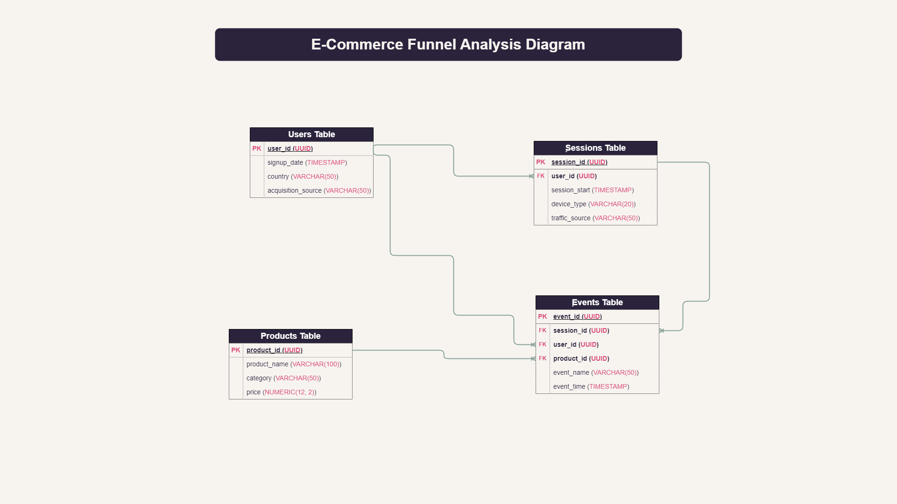

## **Data Preparation**
### **Data Quality Assessment**
A comprehensive data quality assessment was performed before moving data from the **raw** layer to the **analytics** layerو The assessment focused on validating data completeness, uniqueness, referential integrity, and event consistency to ensure the dataset was reliable for funnel analysis.

The following checks were performed:
- Checked for exact duplicate records across all tables.
- Validated primary key uniqueness.
- Assessed missing values and data completeness.
- Validated referential integrity between related tables.
- Identified orphan records.
- Validated timestamp consistency.
- Verified event sequence consistency within user sessions.
- Evaluated event-level integrity before creating the analytical layer.

### **Issues Found**
**Missing Values**
- **1,000** missing values were found in the country column of the users table (**2%** of users).
- **9,000** missing values were found in the **traffic_source** column of the sessions table (**3%** of sessions).

**Duplicate Records**
- The events table contained **25,678** duplicated records, resulting in **12,839** redundant rows that needed to be removed.
- Duplicate event records also introduced **primary key uniqueness violations** in the **event_id** field.

**Primary Key Integrity Violations**
- Additional investigation revealed that some duplicated **event_id** values were not simple duplicate rows.
- Multiple records shared the same **event_id** while containing conflicting event definitions, violating the assumption that each **event_id** should uniquely identify a single event.

**Referential Integrity Issues**
- **6,567** orphan event records were identified where the referenced **session_id** did not exist in the sessions dataset.
- No orphan records were found for **user_id** or **product_id** relationships.

### **Data Cleaning Process**
The following cleaning and validation steps were applied before loading the data into the **analytics** schema:

**Handling Missing Values**
- Missing values in the **country** column were replaced with '**Unknown**' to preserve user records while maintaining dataset completeness.
- Missing values in the **traffic_source** column were replaced with '**Unknown**' rather than imputing a dominant source value, preventing the introduction of artificial acquisition patterns and preserving analytical neutrality.

**Removing Duplicate Records**
- Exact duplicate event records were identified using a window-function-based deduplication approach.
- Only the first occurrence of each duplicated event record was retained, while redundant copies were excluded from the analytics layer.

**Resolving Primary Key Violations**
- After removing exact duplicates, additional **event_id** uniqueness violations remained.
- Since **event_id** is expected to uniquely identify an event, only one record was retained per conflicting **event_id**, and duplicate event definitions were excluded from the analytical dataset.

**Resolving Referential Integrity Issues**
- Orphan event records referencing **non-existent** sessions were excluded during the loading process.
- Referential integrity was enforced by loading only events associated with valid sessions in the analytics layer.

### **Final Validation**
**After cleaning**:
- All primary keys were unique.
- No orphan records remained.
- Foreign key relationships were successfully enforced.
- The dataset was successfully loaded into the **analytics** schema and validated for funnel analysis.

### Performance Optimization
Indexes were created on frequently joined and filtered columns to improve analytical query performance, particularly for funnel stage calculations, session-level analysis, and event aggregation.

## **Exploratory Data Analysis (EDA)**
- The **users** table contains **50,000** users, the **products** table contains **500** products, the **sessions** table contains **500,000** sessions and the **events** table contains **1,300,369** events.

### **Geographic Distribution of Users**
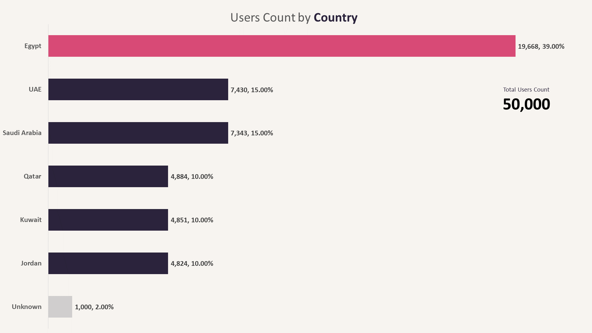
#### **Key Findings**
- The platform has a user base of **50,000** users distributed across **six** primary markets in the Middle East.
- **Egypt** represents the largest user segment, accounting for **39.3%** of all registered users (**19,668 users**), making it the platform's dominant market.
- **UAE** (**14.9%**) and **Saudi Arabia** (**14.7%**) contribute similar user volumes, forming the second-largest user groups after Egypt.
- **Qatar** (**9.8%**), **Kuwait** (**9.7%**), and **Jordan** (**9.6%**) show a relatively balanced distribution, indicating consistent market penetration across these countries.
- **2%** of users have an **unknown** country due to missing values in the source data.
#### **Business Interpretation**
- User acquisition is highly concentrated in **Egypt**, suggesting that the platform's strongest market presence and brand awareness currently exist there.
- While **Egypt** remains the primary growth driver, the relatively similar user shares across the **UAE**, **Saudi Arabia**, **Qatar**, **Kuwait**, and **Jordan** indicate an opportunity to expand regional penetration through targeted acquisition and retention initiatives.
- Further analysis should determine whether user activity and conversion performance follow the same geographic pattern or if some markets generate disproportionately higher engagement and revenue despite having smaller user bases.
### **Users Distribution by Acquisition Source**
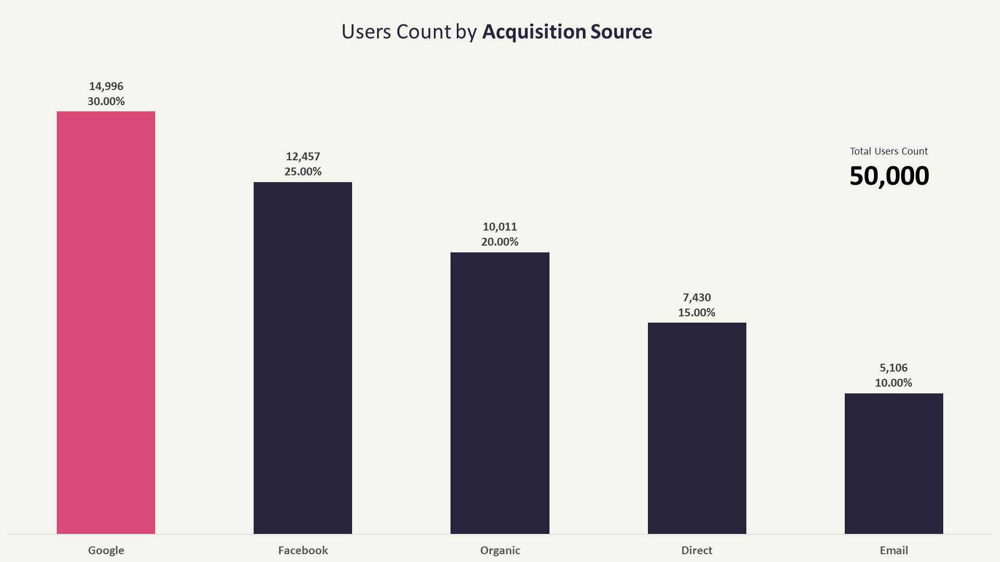
#### **Key Findings**
- **Google** is the largest acquisition channel, contributing **30%** of all users (**14,996** users).
- **Facebook** is the second-largest acquisition source, accounting for **25%** of users (**12,457** users).
- Together, **Google** and **Facebook** contribute **55%** of the total user base, making them the primary acquisition drivers.
- **Organic** traffic represents **20%** of users, indicating a meaningful level of non-paid user acquisition.
- **Direct** traffic contributes **15%** of users.
- **Email** is the smallest acquisition source, accounting for **10%** of users.
#### **Business Interpretation**
- User acquisition appears to be heavily driven by marketing channels, particularly **Google** and **Facebook**, which together account for more than half of all registered users.
- The platform maintains a healthy mix of acquisition channels, with **Organic** and **Direct** traffic contributing **35%** of users, reducing complete dependence on paid acquisition.
- While **Email** contributes the smallest share of users, its effectiveness cannot be evaluated based on acquisition volume alone, Further analysis is required to determine whether email-acquired users demonstrate stronger engagement, retention, or conversion behavior than users acquired through other channels.
### **Users Signup Trend**
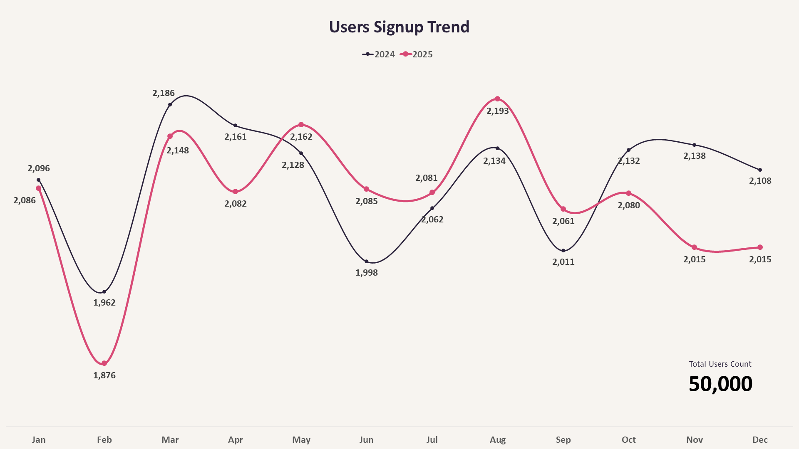
#### **Key Findings**
- User registrations remained relatively stable throughout the analysis period (**January 2024** – **December 2025**).
- Monthly registrations ranged between **1,876** users (**February 2025**) and **2,193** users (**August 2025**).
- No significant spikes or sudden drops were observed, indicating a consistent user acquisition pattern over time.
- Registration volumes in most months remained close to the overall monthly average, suggesting stable acquisition performance across the two-year period.
- Comparing the same months across years reveals slight **year-over-year** fluctuations, with some months in **2025** experiencing **lower** registrations than their **2024** counterparts.
#### **Business Interpretation**
- The platform appears to maintain a steady user acquisition engine without excessive dependence on seasonal campaigns or one-time growth events.
- The absence of extreme peaks or troughs suggests relatively predictable acquisition performance, which can simplify forecasting and capacity planning.
- While some months in **2025** show **lower** registrations than the same months in **2024**, the differences are relatively small and do not indicate a clear **downward** trend.
- Additional analysis of acquisition channels and conversion performance would be required to determine whether these month-to-month variations reflect changes in marketing effectiveness or normal fluctuations in user demand.
### **User Engagement and Session Distribution**
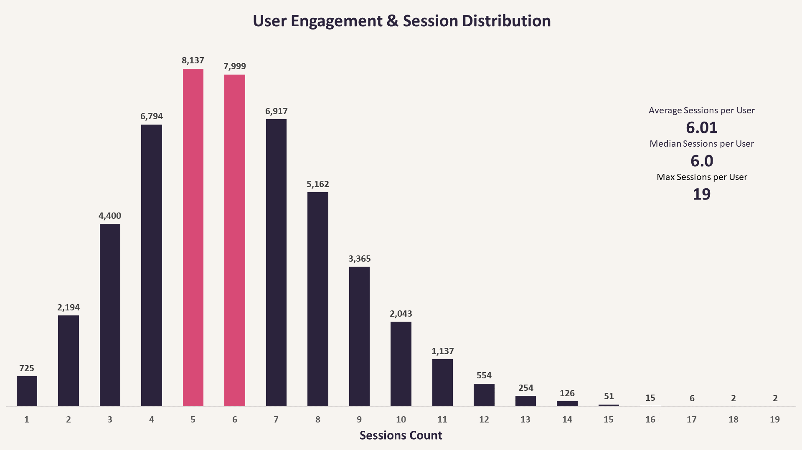
#### **Key Findings**
- Users generated between **1** and **19** sessions during the analysis period.
- The **average** number of sessions per user was **6.01** sessions.
- The **median** number of sessions per user was **6** sessions.
- The close alignment between the **mean** and **median** suggests that session activity is relatively balanced and not heavily influenced by a small group of extremely active users.
#### **Business Interpretation**
- The typical user interacts with the platform approximately **six times** during the two-year period.
- User engagement appears to be broadly distributed across the user base rather than concentrated among a small number of highly active users.
- The similarity between the **average** and **median** session counts indicates that the platform does not rely heavily on a few power users to drive overall activity.
- This pattern suggests a relatively healthy engagement distribution, where user activity is spread across a large portion of the customer base.
### **User Engagement and Session Distribution by Device Type**
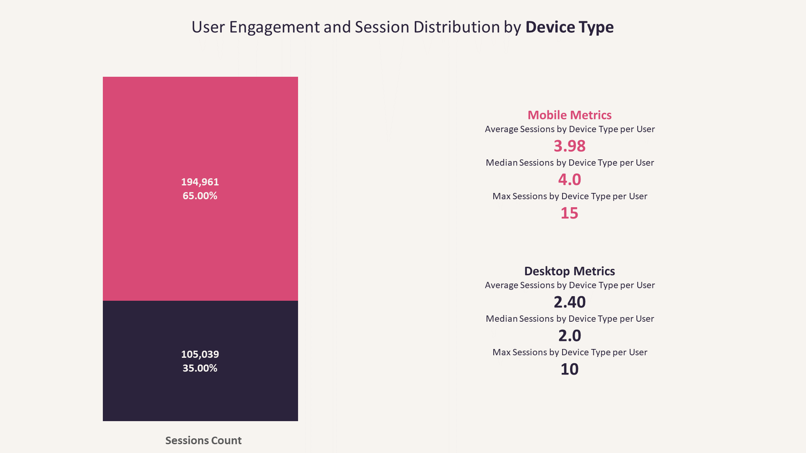
#### **Key Findings**
- **Mobile** devices account for **65%** of all sessions (**194,961** sessions), making them the **dominant** platform used by customers.
- **Desktop** devices account for **35%** of sessions (**105,039** sessions).
- **Mobile** users generate an average of **3.98** sessions per user with a median of **4** sessions.
- **Desktop** users generate an average of **2.40** sessions per user with a median of **2** sessions.
- The highest observed engagement was also higher on **Mobile** (**15** sessions) compared to **Desktop** (**10** sessions).
#### **Business Interpretation**
- User activity is heavily concentrated on **Mobile** devices, both in terms of traffic volume and engagement frequency.
- Mobile users not only represent the majority of sessions but also return more frequently than Desktop users.
- The typical **Mobile** user generates approximately **4** sessions, compared to only **2** sessions for the typical **Desktop** user.
- These findings suggest that the mobile experience plays a critical role in overall platform engagement and should be a primary focus area when evaluating funnel performance and conversion optimization.
### **Sessions Volume by Traffic Source**
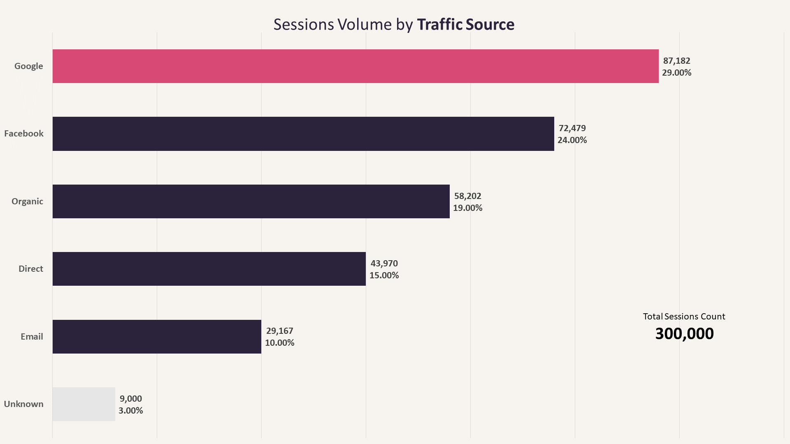
#### **Key Findings**
- **Google** is the largest traffic source, generating **29%** of all sessions (**87,182** sessions).
- **Facebook** is the second-largest traffic source, contributing **24%** of total sessions (**72,479** sessions).
- Together, **Google** and **Facebook** account for **53%** of all platform sessions, making them the primary traffic drivers.
- **Organic** traffic contributes **19%** of sessions, representing a substantial share of user activity generated through **non-paid** channels.
- **Direct** traffic accounts for **15%** of sessions, indicating a meaningful level of direct user engagement with the platform.
- **Email** generates **10%** of sessions, making it the smallest identified traffic source.
- **3%** of sessions have an **unknown** traffic source due to missing values in the original dataset.
#### **Business Interpretation**
- The platform relies heavily on **Google** and **Facebook** as its primary traffic acquisition channels, with more than half of all user sessions originating from these sources.
- Despite the dominance of **paid** and **campaign-driven** channels, **Organic** and **Direct** traffic collectively generate 34% of sessions, suggesting that the platform benefits from existing brand awareness and non-paid user acquisition.
- The relatively strong contribution from **Organic** traffic may indicate effective discoverability and ongoing user interest beyond paid marketing efforts.
- Further analysis is required to determine whether the channels generating the most traffic also produce the highest levels of engagement and conversion throughout the funnel.
### **Events Volume Sanity Check**
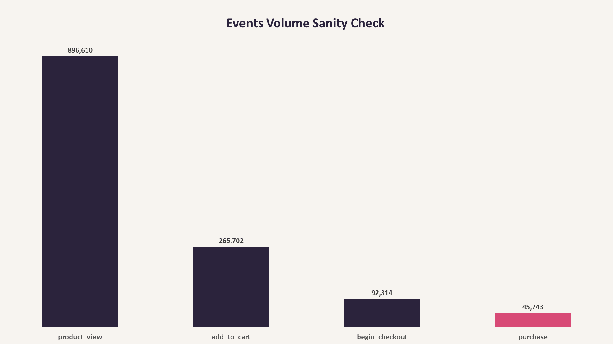
#### **Key Findings**
- The dataset contains **896,610 product view events**, representing the largest volume of activity in the customer journey.
- **265,702 add-to-cart** events were recorded, indicating that only a subset of product views progressed to purchase intent.
- **92,314 begin checkout events** were generated, showing a substantial reduction in user activity between cart creation and checkout initiation.
- The funnel ends with **45,743 purchase events**, representing the smallest event volume in the customer journey.
- Event counts decrease consistently across all funnel stages (**Product View** → **Add to Cart** → **Begin Checkout** → **Purchase**), following the expected customer purchase flow.
#### **Business Interpretation**
- User activity declines at every stage of the purchasing journey, indicating the presence of natural conversion **drop-offs** throughout the funnel.
- **Product views** generate the **highest** level of engagement, but a **significant** portion of users do not progress to adding products to their carts.
- Additional user loss occurs between the **cart** and **checkout** stages, suggesting potential friction points before purchase completion.
- The consistent decrease in event volumes across stages indicates that the event data follows a logical purchase journey and is suitable for funnel conversion analysis.
- These results provide an initial view of customer behavior, however, event counts alone do not measure conversion performance. Session-level funnel analysis is required to quantify conversion rates and identify the stages with the largest drop-offs.
### **Sessions Distribution by Funnel Stage**
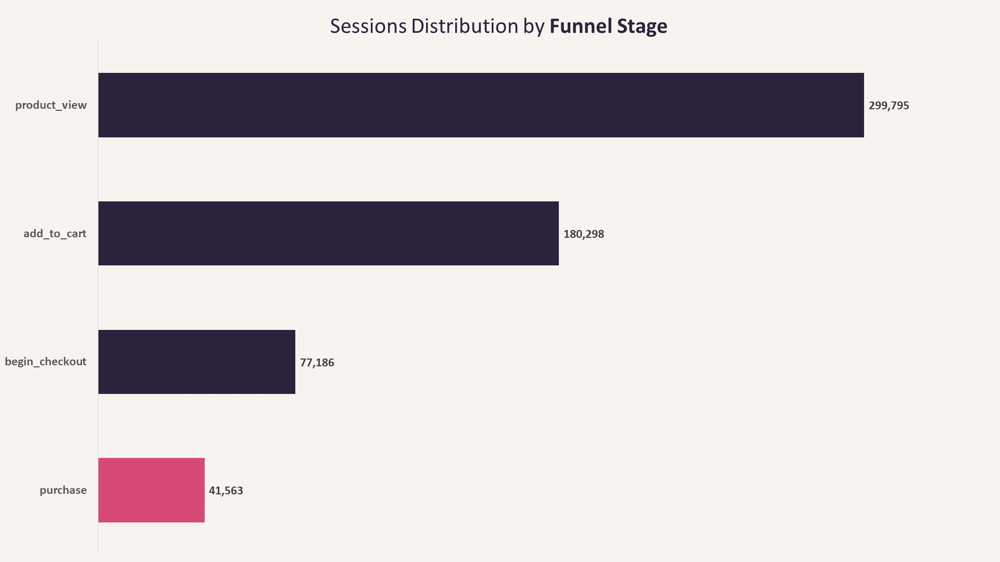
#### **Key Findings**
- **299,795** sessions reached the **Product View** stage, making it the most common stage in the customer journey.
- **180,298** sessions progressed to **Add to Cart**, indicating a substantial reduction from the initial product-view stage.
- **77,186** sessions reached **Begin Checkout**, showing a significant drop between cart creation and checkout initiation.
- **41,563** sessions completed a **Purchase**, representing the smallest share of sessions in the funnel.
- The number of sessions decreases consistently across all stages (**Product View** → **Add to Cart** → **Begin Checkout** → **Purchase**), following the expected progression of an e-commerce purchasing journey.
#### **Business Interpretation**
- The majority of shopping sessions begin with product browsing, but only a portion of those sessions progress to later stages of the funnel.
- A noticeable decline occurs between **Product View** and **Add to Cart**, suggesting that many users browse products without expressing purchase intent.
- Additional **drop-offs** occur between **Add to Cart** and **Begin Checkout**, indicating potential friction before users commit to the checkout process.
- The continued decline toward **Purchase** highlights that only a subset of shopping sessions ultimately convert into completed transactions.
- The consistent stage-to-stage reduction confirms that the dataset follows a logical funnel structure and is suitable for **session-based conversion analysis**.
### **Unique Users Distribution by Funnel Stage**
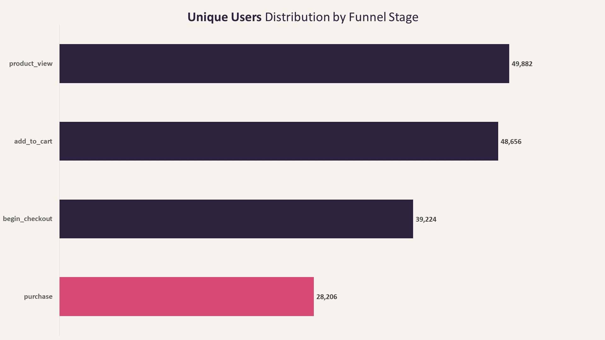
#### **Key Findings**
- Nearly all users (**49,882** out of **50,000**) reached the **Product View** stage at least once during the analysis period.
- **48,656 users** progressed to **Add to Cart**, indicating that most users who viewed products eventually expressed purchase intent.
- **39,224** users reached **Begin Checkout**, while **28,206 users** completed at least one purchase.
- Event participation decreases consistently across funnel stages, following the expected customer journey.
- Approximately **56% of users completed at least one purchase** during the two-year observation period.
#### **Business Interpretation**
- Product discovery and initial purchase intent appear strong, as the majority of users progressed from product viewing to adding items to their carts.
- User drop-off becomes more pronounced during the checkout process, suggesting that purchase completion represents the primary conversion challenge.
- More than half of the user base completed at least one purchase, indicating a relatively healthy long-term customer conversion rate.
- Because users can generate multiple sessions over time, user-level participation should not be interpreted as funnel conversion. A session-based funnel analysis is required to accurately measure stage-to-stage conversion rates and identify where shopping sessions are being lost.

## **Analysis Unit**
**The funnel analysis was conducted at the session level, using session_id as the primary unit of analysis.**

**This approach was chosen because the dataset captures user interactions as event sequences occurring within individual sessions. The funnel stages (product_view → add_to_cart → begin_checkout → purchase) represent actions that can occur during a single visit to the platform, making the session the most appropriate level for measuring progression through the funnel.**

**While user-level analysis is also possible, a single user may generate multiple sessions with different outcomes. Measuring conversion at the user level could therefore combine multiple journeys into one observation and obscure where drop-offs occur. Using sessions allows each shopping journey to be evaluated independently, providing a more accurate view of funnel performance and stage-to-stage conversion behavior.**

## **Key Business Questions**
- **1. What is the overall funnel conversion rate?**
- **2. How does conversion perform at each stage of the funnel?**
- **3. How does funnel performance differ by device type?**
- **4. How does funnel performance differ by traffic source?**
- **5. How does funnel performance differ by country?**
- **6. Which product categories have the highest and lowest conversion rates?**
- **7. Which acquisition sources generate the highest estimated revenue?**

## **Analysis**
### **1. What is the overall funnel conversion rate?**
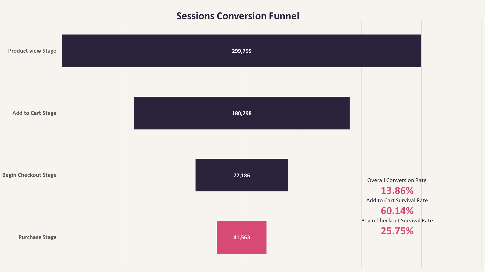
#### **Key Insights**
- **299,795** sessions entered the funnel through the **Product View** stage, representing the starting point of the customer journey.
- **180,298** sessions progressed to **Add to Cart**, resulting in a **60.14%** Survival Rate from the initial stage.
- **77,186** sessions reached the **Begin Checkout** stage, corresponding to a **25.75%** Survival Rate from Product View.
- **41,563** sessions completed a **purchase**, producing an Overall Funnel Conversion Rate of **13.86%**.
- The cumulative decline in session counts across the funnel indicates progressive user **drop-off** as customers move toward completing a purchase.
#### **Business Interpretation**
- Approximately **4 out of every 10 sessions** exited the funnel before adding a product to the cart, While this represents the first major reduction in funnel volume, additional analysis is required to determine whether the drop-off is driven by product attractiveness, pricing, user experience, or expected customer behavior.
- Only about **one quarter** of sessions that viewed a product progressed to the checkout stage, indicating substantial cumulative abandonment before users initiated the payment process.
- The platform achieved an **Overall Conversion Rate of 13.86%**, meaning that roughly **14 out of every 100** product-view sessions resulted in a completed purchase, This provides an initial indication of funnel performance but does not identify where the most significant conversion losses occur.
- Since survival rates measure cumulative progression from the first funnel stage, they do not reveal the efficiency of transitions between consecutive stages, Therefore, the next step is to analyze Stage-to-Stage Conversion Rates to accurately identify the funnel stage with the highest user drop-off.
---
### **2. How does conversion perform at each stage of the funnel?**
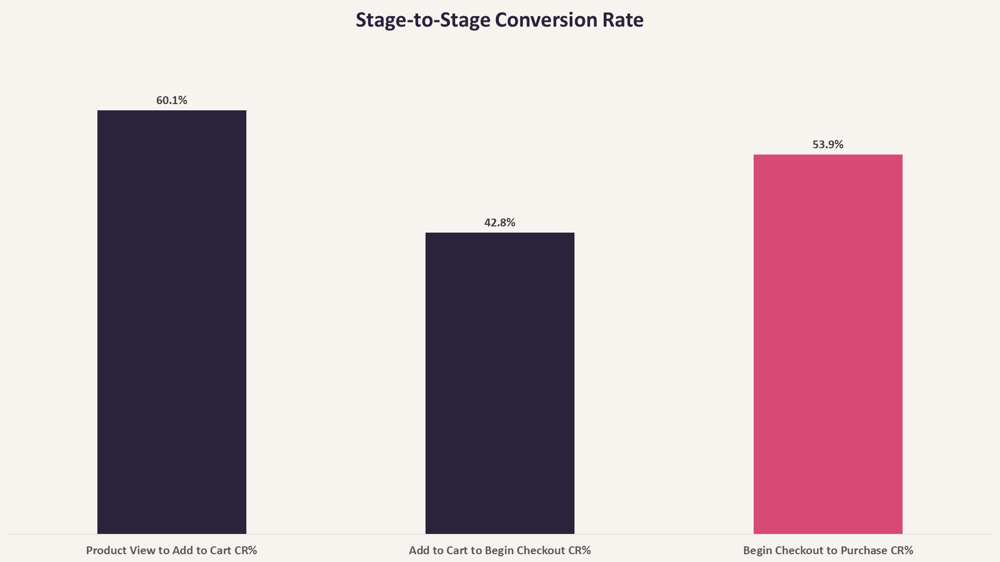
#### **Key Insights**
- **60.14%** of sessions progressed from **Product View** to **Add to Cart**.
- The conversion rate decreased to **42.81%** between **Add to Cart** and **Begin Checkout**, representing the lowest conversion rate across all funnel transitions.
- **53.85%** of sessions that reached **Begin Checkout** completed a purchase.
- The transition from **Add to Cart** to **Begin Checkout** experienced the highest stage-specific drop-off, with **57.19%** of sessions failing to continue.
#### **Business Interpretation**
- A majority of product-view sessions progressed to the **Add to Cart** stage, indicating that many visitors showed initial purchase intent after viewing a product.
- The most significant conversion **loss** occurred between **Add to Cart** and **Begin Checkout**, where fewer than half of cart sessions advanced to the checkout process, This stage represents the primary opportunity for further investigation and optimization.
- Once users entered the checkout process, more than half successfully completed a purchase, suggesting that the checkout experience retains a relatively large proportion of engaged customers.
- Since the largest drop-off occurs before checkout begins, future analysis should focus on understanding why users abandon their carts before initiating the payment process. Potential areas for investigation include pricing, shipping costs, account requirements, or other sources of friction prior to checkout.
---
### **3. How does funnel performance differ by device type?**
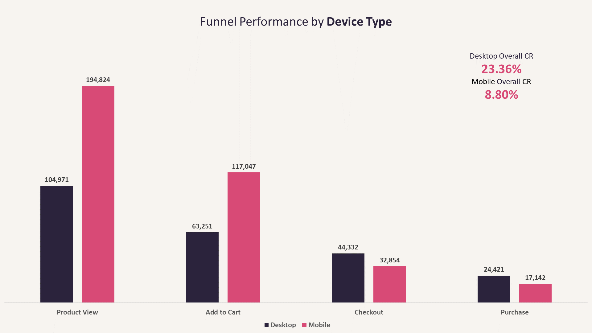
#### **Key Insights**
- **Mobile** generated the majority of funnel activity, accounting for substantially more product views and cart additions than Desktop.
- Despite attracting more sessions, **Mobile** achieved an **Overall Conversion Rate** of only **8.80%**, compared with **23.26%** on **Desktop**.
- The largest performance gap appears after the **Add to Cart** stage, where relatively fewer **Mobile** sessions progressed to **Begin Checkout**.
- **Desktop** consistently retained a higher proportion of sessions throughout the purchasing journey, resulting in a significantly stronger overall conversion performance.
#### **Business Interpretation**
- Although **Mobile** drives most customer traffic, its ability to convert sessions into completed purchases is considerably weaker than **Desktop**, This suggests that higher traffic alone does not translate into stronger business outcomes.
- The sharp decline between **Add to Cart** and **Begin Checkout** on **Mobile** indicates that this transition deserves further investigation, Potential areas to examine include mobile usability, checkout accessibility, page performance, or other sources of friction that may discourage users from initiating checkout.
- **Desktop** users demonstrate substantially stronger conversion behavior throughout the funnel, suggesting a smoother purchasing experience or higher purchase intent.
- Since **Mobile** contributes the majority of customer sessions, even modest improvements in **Mobile** funnel performance could have a meaningful impact on overall revenue.
---
### **4. How does funnel performance differ by traffic source?**
| Traffic Source | Product View | Add to Cart | Checkout | Purchase | Overall CR% |
| -------------- | ------------ | ----------- | -------- | -------- | ----------- |
| **Direct**     |  43,936      | 26,577      | 11,430   | 6,752    | **15.37%**  |
| **Google**     |  87,131      | 52,083      | 22,425   | 13,103   | **15.04%**  |
| **Unknown**    |  8,991       | 5,365       | 2,294    | 1,342    | **14.93%**  |
| **Email**      |  29,148      | 17,611      | 7,477    | 4,344    | **14.90%**  |
| **Oraganic**   |  58,159      | 35,142      | 14,801   | 8,596    | **14.78%**  |
| **Facebook**   |  72,430      | 43,520      | 18,759   | 7,426    | **10.25%**  |
#### **Key Insights**
- **Google** generated the highest volume of funnel sessions across all stages, followed by **Facebook** and **Organic**, consistent with the traffic distribution observed during the EDA.
- Overall conversion performance remained remarkably consistent across most traffic sources, with conversion rates ranging between **14.78%** and **15.37%**.
- **Direct** achieved the **highest** Overall Conversion Rate (**15.37%**), although the advantage over **Google**, **Email**, **Organic**, and **Unknown** was relatively small.
- **Facebook** was the only traffic source that noticeably underperformed, recording an Overall Conversion Rate of **10.25%**, substantially below all other acquisition channels.
#### **Business Interpretation**
- The analysis suggests that most traffic sources generate users with similar purchase behavior once they enter the funnel, Differences in traffic volume do not necessarily translate into meaningful differences in conversion efficiency.
- While **Direct** produced the **highest** conversion rate, the margin over other high-performing channels is relatively small, indicating no single traffic source clearly dominates funnel performance.
- **Facebook** stands out as the only channel with significantly weaker conversion performance, This may indicate differences in user intent, campaign targeting, or the quality of traffic acquired through this source. Further investigation into Facebook campaigns and audience segments would be valuable to understand the cause of this lower conversion rate.
---
### **5. How does funnel performance differ by country?**
| Country        | Product View | Add to Cart | Checkout | Purchase | Overall CR% |
| -------------- | ------------ | ----------- | -------- | -------- | ----------- |
| **Unknown**    |  6,025       | 3,681       | 1,602    | 849      | **14.09%**  |
| **َQatar**      |  29,463      | 17,606      | 7,484    | 4,141    | **14.05%**  |
| **Saudi Arabia** |  44,021    | 26,610      | 11,402   | 6,152    | **13.98%**  |
| **Kuwait**     |  29,338      | 17,438      | 7,478    | 4,072    | **13.88%**  |
| **UAE**        |  44,286      | 26,670      | 11,367   | 6,122    | **13.82%**  |
| **Jordan**     |  29,033      | 17,462      | 7,406    | 4,010    | **13.81%**  |
| **Egypt**      |  117,629     | 70,831      | 30,447   | 16,217   | **13.79%**  |
#### **Key Insights**
- Overall funnel performance is highly consistent across all countries, with conversion rates ranging from **13.79%** to **14.09%**.
- Egypt contributes the largest funnel volume at every stage, reflecting its position as the platform's largest user base.
- No country demonstrates a materially higher or lower conversion rate, suggesting that users progress through the purchasing funnel at similar rates regardless of geography.
- The **Unknown** country segment recorded the highest conversion rate (**14.09%**), but the difference is marginal and should not be interpreted as a meaningful performance advantage.
#### **Business Interpretation**
- Geographic location does not appear to be a major driver of funnel performance in the current dataset. The purchasing journey remains consistently efficient across all represented markets.
- Since conversion behavior is broadly similar across countries, optimization efforts are likely to produce greater business impact if focused on other dimensions such as **device type** or **traffic source** where larger performance gaps were observed.
- Although the **Unknown** segment shows the highest conversion rate, it represents a small portion of the data and should primarily be viewed as a reminder of the importance of maintaining high data quality rather than as evidence of superior market performance.
---
### **6. Which product categories have the highest and lowest conversion rates?**
- **Unlike the previous analyses, this question uses the session–product pair as the unit of analysis because a single session may contain interactions with multiple products across different categories.**

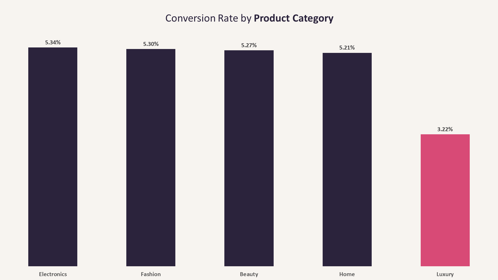
#### **Key Insights**
- **Electronics** achieved the highest Overall Conversion Rate at **5.34%**.
- **Luxury** recorded the lowest Overall Conversion Rate at **3.22%**, substantially below all other product categories.
- **Fashion**, **Beauty**, **Home**, and **Electronics** exhibited highly consistent conversion performance, with conversion rates ranging from **5.21%** to **5.34%**.
- **Luxury** is the only category that significantly deviates from the overall pattern, indicating weaker progression from product views to completed purchases.
#### **Business Interpretation**
- Conversion performance is generally stable across most product categories, suggesting a consistent purchasing experience regardless of category.
- The **Luxury** category stands out as a clear underperformer, converting approximately **40%** less efficiently than the leading categories (**3.22% vs. ~5.3%**), This may indicate higher customer hesitation, stronger price sensitivity, longer purchase decision cycles, or category-specific friction.
- Since the remaining categories exhibit very similar conversion rates, optimization efforts should prioritize understanding and improving the **Luxury** purchasing journey, where the greatest opportunity for improvement appears to exist.
---
### **7. Which acquisition sources generate the highest estimated revenue?**
| Acquisition Source | Purchase Count | Estimated Revenue | Purchasing Users | Avg Estimated Revenue per User | Avg Estimated Revenue per Purchase | 
| ------------------ | -------------- | ----------------- | ---------------- | ------------------------------ | ---------------------------------- |
| **Google**         |  13,888        | 6,256,788         | 8,518            | 734                            | 451                                |
| **Facebook**       |  11,352        | 5,233,987         | 6,985            | 749                            | 461                                |
| **Organic**        |  8,996         | 4,031,829         | 5,620            | 717                            | 448                                |
| **Direct**         |  6,793         | 3,154,667         | 4,199            | 751                            | 464                                |
| **Email**          |  4,714         | 2,106,017         | 2,884            | 730                            | 447                                |
#### **Key Insights**
- **Google** is the leading acquisition source in terms of volume, generating **13,888** purchases and the highest estimated revenue (**$6.25M**).
- **Facebook** follows closely in both purchase volume and revenue, contributing **$5.23M** in estimated revenue.
- Despite differences in volume, Average Revenue per User (ARPU) is relatively stable across all acquisition sources, ranging from approximately **$717** to **$751**, indicating consistent user value regardless of acquisition channel.
- **Direct** traffic generates the highest value per purchase (**$464**), suggesting stronger purchase intent or higher value product selection among users arriving directly.
- **Organic** traffic shows the lowest ARPU (**$717**) and lowest purchase value per transaction, but still maintains solid volume, making it an **efficient but lower value** channel.
#### **Business Interpretation**
- Acquisition sources primarily differ in **scale (volume)** rather than **quality (user value)**, as ARPU is relatively stable across all channels.
- **Google and Facebook dominate revenue contribution**, driven mainly by higher traffic volume rather than significantly higher per user value.
- The consistency in ARPU suggests that once users enter the funnel and convert, their purchasing behavior is relatively uniform across acquisition channels.
- **Direct traffic stands out with the highest value per purchase**, which may indicate:
    - Higher intent users (returning customers or brand-aware users).
    - Faster decision making behavior.
- Since revenue differences are mainly volume driven, optimization efforts should focus on:
    - Scaling high volume channels (**Google**, **Facebook**).
    - Improving conversion efficiency in mid volume channels (**Organic**, **Email**).

## **Conclusion**
This analysis examined the complete e-commerce conversion funnel, tracking customer journeys from product views to completed purchases using the **session** as the primary unit of analysis. After performing a comprehensive data quality assessment and cleaning process, the analysis focused on identifying conversion performance, funnel bottlenecks, and behavioral differences across key customer segments.

The overall funnel achieved a **13.86%** session conversion rate, indicating that approximately one in seven sessions that viewed a product ultimately resulted in a purchase. While the initial transition from **Product View to Add to Cart** performed relatively **well**, the largest funnel loss occurred between the **Add to Cart and Begin Checkout** stages, identifying this transition as the primary opportunity for conversion improvement.

Segment-level analysis revealed that **device type** had the strongest impact on conversion performance. Although mobile devices generated the majority of platform traffic, they converted substantially worse than desktop sessions, suggesting potential usability or checkout friction on mobile devices.

Across traffic sources and countries, conversion performance remained remarkably consistent, indicating that acquisition channels and geographic markets contribute similar quality traffic. Revenue differences across acquisition sources were primarily driven by traffic volume rather than higher customer value per user.

Product level analysis showed generally stable conversion rates across most categories, with **Luxury** products standing out as a clear **underperformer**. This suggests that category specific purchasing behavior, pricing sensitivity, or customer decision complexity may be limiting conversion performance.

Overall, the analysis indicates that the platform's primary growth opportunities are not in acquiring additional traffic alone, but in improving funnel efficiency, particularly by **reducing checkout abandonment on mobile devices** and optimizing the purchasing journey for **Luxury** products. Addressing these bottlenecks has the potential to increase conversions without requiring additional customer acquisition investment.

## **Recommendations**
- **Optimize the mobile purchasing experience**, particularly the transition from **Add to Cart to Begin Checkout**. Given that mobile accounts for the majority of sessions but exhibits substantially lower conversion performance than desktop, further investigation into mobile usability, page performance, checkout flow, and payment experience is recommended.
- **Investigate the Luxury product category** to understand the causes of its significantly lower conversion rate. Additional analysis of pricing strategy, product presentation, customer reviews, shipping policies, and purchase behavior may help identify barriers to conversion.
- **Analyze the Add to Cart → Checkout transition** in greater detail. As this stage represents the largest funnel **drop-off**, future analysis should examine checkout friction, cart abandonment patterns, and potential UX issues to identify optimization opportunities.
- **Continue improving data quality** by reducing records with **Unknown** country and traffic source values. Although these represent a relatively small proportion of the data, improving attribute completeness will enable more reliable segmentation and marketing analysis.
- **Expand future analysis beyond the conversion funnel**. Incorporating customer retention, cohort analysis, repeat purchase behavior, and customer lifetime value (LTV) would provide a more comprehensive understanding of long term customer performance and business growth.

## Tools Used
- **PostgreSQL**
    - Used as the primary database management system (DBMS) for querying, aggregating, and analyzing transactional data.
- **DBeaver**
    - Used as the SQL client for writing and executing queries, and exploring database tables in an interactive environment.
- **Microsoft Excel**
    - Used for quick data validation, exploratory charts, and supporting visual analysis during EDA.
- **Microsoft PowerPoint**
    - Used for creating final visualizations and presenting key insights in a structured business-friendly format.
- **Visual Studio Code (VS Code)**
    - Used for organizing SQL scripts, building the project structure, and maintaining documentation (README and analysis files).

